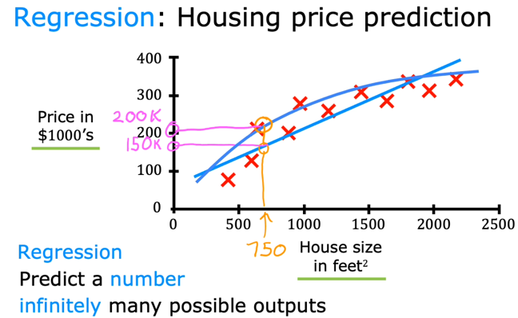
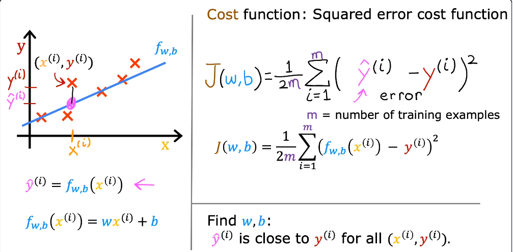
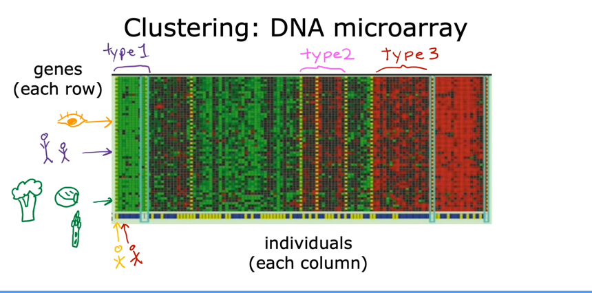

# Intro to Machine Learning

## Key Concepts
1. Supervised Learning vs Unsupervised Learning
2. Recommender Systems and Reinforcement learning

### Terminology
| General Notation    | Description | Python (if applicable)|
|:--------------------| :--- | :--- |
| $a$                 |scalar, non bold||
| **a**               |vector bold||
| Regression          |||
| **x**               |Training example feature values (Size 1000 sqft)|`x_train`|
| **y**               |Traininig example targets (Price 1000s of Dollars)|`y_train`|
| $x^{(i)}$,$y^{(i)}$ |$i_{th}$ Training Example|`x_i`, `y_i`|
| m                   |Number of Training Examples|`m`|
| $w$                 |parameter: weight|`w`|
| $b$                 |parameter: bias|`b`|
| $f_{w,b}(x^{(i)})$  |The result of the models evauation at $x^{(i)}$ parameterized by $w,b:f_{w,b}(x^{(i)})=wx^{(i)}+b$|`f_wb`|

### Supervised Learning:
- Algorithms that learn from being given right answers X (Input) -> Y (Output) mappings i.e. input -> output labels
  - This way of learning is done by providing the right answers for model to learn
  - Once we have enough inputs/outputs run through a learning algorithm now it can predict the answer for any input going forward
- Real world examples of supervised learning:
  - **spam filtering**, email (X) -> spam?(Y) (0/1)
  - **speech recognition**, audio -> text transcript
  - **machine translation**, English -> Spanish
  - **online advertising**, ad, user info -> likelihood of clicking (0/1)
  - **self-driving**, image, radar info -> position of other cars
  - **visual inspection**, in manufacturing final product image -> defects (0/1)
- Another good example of using labeling to train a model via supervised learning is house price prediction. Below graph shows this:

- Types of supervised learning algorithms:
  - **Regressing**, model learns to predict a number from infinitely possible outputs
  - **Classification**, model predicts category from a small number of possible outputs
    - Learning algorithm **create a boundary around data plotted** to figure out which category an input belongs to
- When should you use Classification vs Regression?
  - Classification is used to distinguish between finite set of labels or predict categories
    - Ex. male or female, fraud transaction or not, 10 labels or 10,000 labels
  - Regression is predicting a specific number. This number is not part of a discrete values but rather predict a continuous variable
    - Predict stock price
    - Housing price prediction based on sqft, no of rooms etc

> [!NOTE]
> **Learning Algorithm Model Function**: \
> $$f_{w,b}(x) = wx + b$$, x is features/inputs, the numbers w and b will determine the predicted output ($$\hat{y}$$)

#### Linear Regression Models 
- Linear Regression with one variable (Univariate linear regression)
  
- Linear Regression Single Input [Jupyter Notebook](./notebooks/supervised-learning/1-linear-regression.ipynb)

> [!NOTE]
> **Cost Function:** (Squared Error Cost Function)\
> A mathematical tool that quantifies the "badness" or error of a model's prediction, measuring the difference between expected and predicted outputs as single number. \
> $$J_{w,b}=\frac{1}{2m}\sum_{i=1}^{m}(\hat{y}^{(i)-y^{(i)}})^{2}$$, m = number of training examples
> $$J_{w,b}=\frac{1}{2m}\sum_{i=1}^{m}(f_{w,b}(x^{(i)})-y^{(i)})^{2}$$

### Unsupervised Learning
- While supervised learning models learn from data labeled with right answer, Unsupervised learning finds patterns from unlabeled data
- In unsupervised learning, data only comes from inputs x but not output labels y. Algorithm has to find structure in the data. 
- Types of unsupervised learning algorithms
  - Clustering, group similar data points together
  - Anomaly detection, Find unusual data points
  - Dimensionality reduction, Take a big dataset and compress it to much smaller data set by losing as little information as possible
- **Clustering algorithm** takes data without labels and automatically groups them into clusters 
  - Clustering is a common use case of unsupervised learning, e.g. cluster a bunch of documents and as someone looks at a document, you can get related documents in cluster
  - Clustering DNA's of multiple people. We ask the model to map the data and classify different types of people together as Type1, Type2, Type3
  
